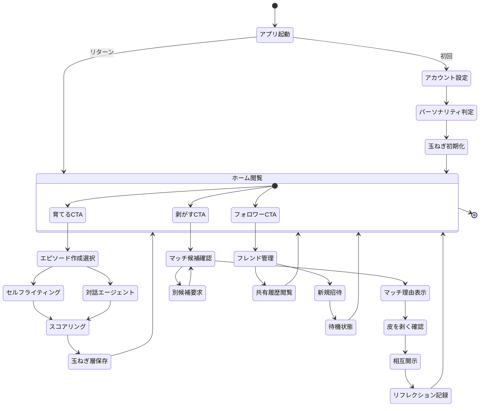

# ユーザー体験フロー（UMLアクティビティ図）

```mermaid
stateDiagram-v2
    [*] --> アプリ起動
    アプリ起動 --> アカウント設定 : 初回
    アプリ起動 --> ホーム閲覧 : リターン

    アカウント設定 --> パーソナリティ判定
    パーソナリティ判定 --> 玉ねぎ初期化
    玉ねぎ初期化 --> ホーム閲覧

    state ホーム閲覧 {
        [*] --> 育てるCTA
        [*] --> 剥がすCTA
        [*] --> フォロワーCTA
    }

    育てるCTA --> エピソード作成選択
    エピソード作成選択 --> セルフライティング
    エピソード作成選択 --> 対話エージェント
    セルフライティング --> スコアリング
    対話エージェント --> スコアリング
    スコアリング --> 玉ねぎ層保存
    玉ねぎ層保存 --> ホーム閲覧

    剥がすCTA --> マッチ候補確認
    マッチ候補確認 --> マッチ理由表示
    マッチ候補確認 --> 別候補要求
    マッチ理由表示 --> 皮を剥く確認
    別候補要求 --> マッチ候補確認
    皮を剥く確認 --> 相互開示
    相互開示 --> リフレクション記録
    リフレクション記録 --> ホーム閲覧

    フォロワーCTA --> フレンド管理
    フレンド管理 --> 共有履歴閲覧
    フレンド管理 --> 新規招待
    新規招待 --> 待機状態
    共有履歴閲覧 --> ホーム閲覧
    待機状態 --> ホーム閲覧

    ホーム閲覧 --> [*]
```

- ホーム画面からの3つの主要導線（育てる／剥がす／フォロワー）を中心に、相互開示やリフレクションまでの体験を俯瞰できるようにした。
- UMLアクティビティ図として、状態と遷移を明示し、既存コンセプトの層構造・マッチングプロセスと整合させている。
