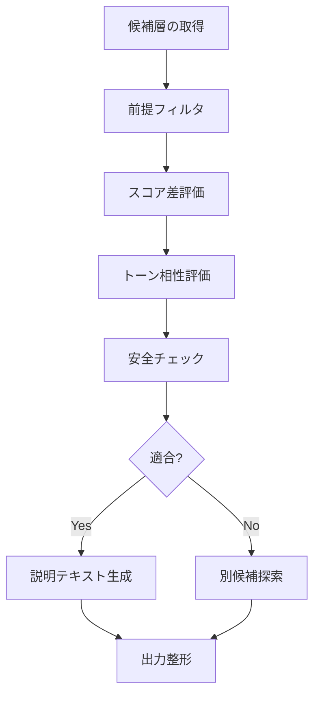

- # エピソードマッチングエージェント設計（2025-10-14）

## 目的
- 二人のユーザーが保持するエピソード（玉ねぎ層）の中から、心理的安全性とテーマ整合性を満たすペアを抽出し、「皮を剥く」体験に供する。
- マッチング判断の根拠を自然言語で返し、ユーザーが納得して共有に進めるよう支援する。

## 想定入力
| フィールド | 説明 |
| --- | --- |
| `user_context` | ユーザーID、関係性タグ（友人/家族など）、最近のリフレクション指標 |
| `episode_pool` | 各ユーザーの未共有エピソード配列 |
| `episode.metadata` | 深さDepth、露出Exposure、複雑さComplexity、支援Need、トピックタグ、トーン（感情ベクトル）、危機フラグ |
| `episode.content_summary` | LLMが生成した300字程度の要約とキーフレーズ |
| `policies` | マッチング閾値、クールダウン閾値、危険ワード一覧、ユーザー設定（例: 深さ7以上は除外） |

## 中核フロー


1. **候補層の取得**  
   - 双方の未共有エピソード集合を取得し、深さ・クールダウン条件で事前ソート。
2. **前提フィルタ**  
   - 危機フラグ（緊急性高）付き層は除外または専用フローへ分岐。  
   - ユーザー設定（例: 「仕事」タグのみ共有）を満たすものに限定。
3. **スコア差評価**  
   - `Depth`差 ≤1、`Exposure`差 ≤2、`SupportNeed`差 ≤2 を満たす組を保持。  
   - 差異が閾値を超えた場合は棄却し、理由（例: 「深さが離れすぎ」）をログへ記録。
4. **トーン相性評価**  
   - 感情ベクトルのコサイン類似度を算出し、閾値（例: 0.6）未満なら「トーン警告」。  
   - 警告がある場合は、ユーザー設定に応じて除外 or 注意テキスト付きで候補に残す。
5. **安全チェック**  
   - クールダウン: 直近高深度シェアからの経過時間が閾値未満なら保留。  
   - サポートリソース: 支援Needが高いのに相手の「リスナー準備スコア」が低い場合は除外。
6. **説明生成**  
   - マッチング成立時は、共通テーマ・深さ整合性・注意点を自然言語で出力。  
   - 棄却理由もログ化し、ユーザーの「別候補要求」に備える。

## 出力
```json
{
  "status": "matched" | "no_match",
  "layer_pair": {
    "user_a_layer_id": "...",
    "user_b_layer_id": "...",
    "score_delta": {"depth": 0, "exposure": 1, "support": 1},
    "tone_similarity": 0.74
  },
  "justification": "両エピソードとも家族介護をテーマにし、深さ差が1以内。トーンは共感的で、支援ニーズも近いです。",
  "alerts": ["クールダウン残り2日"] 
}
```

## データストア要件
- エピソードメタデータは正規化テーブルまたはGraphQLエッジで取得可能にし、差分更新をリアルタイム反映。
- マッチング結果と棄却理由をイベントログに保存し、将来のモデル調整に活用。

## 評価指標（例）
- マッチ成立率／棄却率（理由別）
- シェア後のコンフォートスコア平均
- 安全アラートの感度（真陽性率）
- 別候補リクエストに対する応答時間

## 今後の検討ポイント
- 人間モデレーターのレビューを挟む閾値設定（深さ8以上など）。
- LLMによる説明生成の一貫性チェック（テンプレート×Few-shot）。
- 学習ループ: リフレクション結果からスコア閾値を調整する仕組み。
